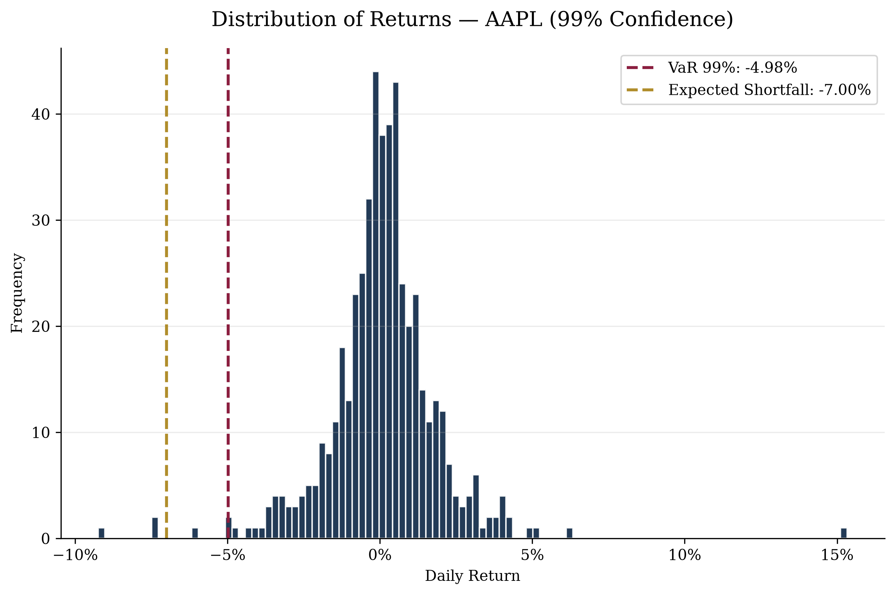

# VaR and Expected Shortfall Calculator

#### Video Demo: https://youtu.be/MQt7WTwN1Gs

## Description

This is my final project for CS50P (Harvard's Introduction to Programming with Python).

The program calculates two of the most common risk metrics used in finance to
estimate potential losses on a stock: **Value at Risk (VaR)** and **Expected
Shortfall (ES)**, also known as Conditional VaR. It downloads real historical
price data for any publicly traded stock ticker, computes daily returns, and
produces a chart showing the distribution of those returns with both metrics
highlighted.

The program is interactive: the user is asked to enter a stock ticker (e.g.
`AAPL`, `NVDA`) and a confidence level (`95` or `99`). If the ticker does not
exist or the confidence level is invalid, the program exits with a clear error
message instead of crashing.

### How it works

`project.py` is built around `main()` and three additional functions:

- **`get_returns(ticker)`**: downloads two years of daily closing prices for
  the given ticker using the `yfinance` library, and returns the daily
  percentage change (`pct_change()`) as a pandas Series, with missing values
  removed. If the ticker does not exist, `yfinance` returns an empty
  DataFrame, and this empty state propagates through as an empty Series —
  which `main()` uses to detect an invalid ticker.
- **`calculate_var(rendimientos, confianza)`**: calculates the historical VaR
  as a percentile of the returns distribution (the 5th percentile for 95%
  confidence, the 1st percentile for 99% confidence), using pandas'
  `quantile()`.
- **`calculate_es(rendimientos, var_his)`**: calculates the Expected
  Shortfall as the average of all returns worse than the VaR threshold — in
  other words, the average loss on the worst days, not just the cutoff
  point.
- **`main()`**: handles user input and validation, calls the three functions
  above, and generates a chart with `matplotlib` showing a histogram of daily
  returns with the VaR and Expected Shortfall marked as vertical lines, plus
  a legend with the exact values. The chart is saved as a PNG file and also
  displayed on screen.

Example output for `AAPL` at 99% confidence:

## Design Decisions

- **Historical VaR over parametric or Monte Carlo methods**: historical VaR
  was chosen because it makes no assumption about the shape of the returns
  distribution (e.g. normality) and is straightforward to compute directly
  from real market data with the pandas tools covered in CS50P. Parametric
  and Monte Carlo approaches were considered but left out of scope for this
  project.
- **Two years of daily data**: chosen as a balance between having enough
  observations (~500 trading days) for the percentile calculations to be
  meaningful, and keeping the download fast.
- **Free-text ticker input instead of a fixed menu**: the initial plan was a
  numbered menu with a fixed list of tickers. This was replaced with free
  text input validated directly against `yfinance` (via `get_returns()`
  returning an empty Series for invalid tickers), which is more flexible and
  lets the user analyze any ticker, not just a pre-selected few.
- **`sys.exit()` on invalid input**: rather than looping and re-prompting the
  user, the program simply exits with a message on invalid ticker or
  confidence level. This keeps the control flow simple, which was judged
  appropriate for the scope of this project.
- **Chart annotated directly with the numeric results**: instead of only
  printing the VaR/ES values to the terminal, both are shown as labeled
  vertical lines directly on the histogram, so the risk metrics can be
  understood visually in the context of the full returns distribution.
